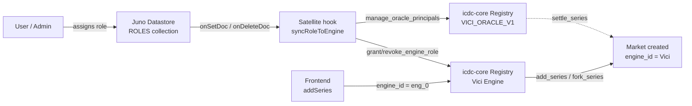

# Vici ↔ icdc-core Engine Integration

This document describes how the Vici app integrates with the `icdc-core` prediction-market
registry as an **Engine**, and how user roles in Juno are automatically reflected as role
grants on that engine.

## Why an Engine?

`icdc-core` supports multi-tenant authorization through a first-class `Engine` model:

- **Controllers** of the registry canister can do anything.
- **Engine admins** can grant / revoke engine-scoped roles (`Creator`, `OracleAdmin`) to any
  principal, without being controllers of the registry.
- **Role grants** authorize the holder to call `add_series` / `fork_series` (for `Creator`)
  or `add_oracle` / `update_oracle_metadata` / `manage_oracle_principals` (for `OracleAdmin`)
  **without** being a canister controller.

Registering Vici as its own engine lets us:

1. Scale the app beyond "only the deploy principal can create markets".
2. Delegate market creation to app admins/creators through normal Juno auth flows.
3. Keep Juno as the single source of truth for user roles; the registry just mirrors them.

See [docs/architecture/engines.md](https://github.com/AntonioVentilii/icdc-core/blob/master/docs/architecture/engines.md)
in `icdc-core` for the protocol-side design.

## Architecture



Responsibilities:

| Component                                        | Role                                                                            |
| ------------------------------------------------ | ------------------------------------------------------------------------------- |
| `scripts/init/init.icdc-engine.sh`               | Registers the Vici engine, adds the satellite + human admins                    |
| `src/satellite/services/engine-sync.services.ts` | Hook that grants/revokes engine roles in response to `roles` doc changes        |
| `src/lib/constants/icdc.constants.ts`            | Single place that pins the engine id (`eng_0`) used by the frontend + satellite |
| `src/lib/services/market.services.ts`            | Passes `engine_id` to `add_series` so non-controller admins can create markets  |
| `scripts/init/init.registry.sh`                  | Seeds demo markets, now tagging them with `engine_id = opt "$VICI_ENGINE_ID"`   |
| `scripts/test/test-engine-sync.sh`               | Smoke test: verifies engine registration, admin list, allowed roles, grant flow |

## Role mapping

Regular users have **no role doc** in Juno. That state is what was previously encoded as
`USER` / `MODERATOR` and grants nothing — no engine role, no entry in
`VICI_ORACLE_V1.authorized_principals`. See `UserRole` in `src/lib/enums/user.ts` for the
canonical list of grantable roles.

| Juno `UserRole` | icdc-core `EngineRole`s granted | Added to `VICI_ORACLE_V1.authorized_principals`? |
| --------------- | ------------------------------- | ------------------------------------------------ |
| `CONTROLLER`    | _(none — controllers bypass)_   | _(no — controllers bypass)_                      |
| `ADMIN`         | `Creator`, `OracleAdmin`        | yes                                              |
| `SOLVER`        | `OracleAdmin`                   | yes                                              |
| `CREATOR`       | `Creator`                       | no                                               |
| `GROUP_CREATOR` | _(none)_                        | no                                               |

The hook computes the **diff** between the previous and new role and issues only the needed
`grant_engine_role` / `revoke_engine_role` calls, plus a single `manage_oracle_principals`
call when the user's `OracleAdmin` membership changes. Everything is idempotent:
`RoleAlreadyGranted` / `RoleNotGranted` are treated as no-ops, and the oracle's
`authorized_principals` is a set so duplicate adds / missing removes are no-ops at the
protocol level. On delete, the hook revokes whatever the deleted doc was mapped to.

If the oracle is not yet registered when the hook runs (e.g. a role is assigned before
`init:registry` has been executed), `OracleNotFound` is logged as `engine_sync_skipped_missing_oracle`
and the engine-role grant still proceeds. Once the oracle is bootstrapped, save the role
doc again to replay the sync — or reconcile manually via `dfx`.

### Why oracle settlers piggyback on roles

Vici runs a single oracle (`VICI_ORACLE_V1`) today. Anyone who has `EngineRole::OracleAdmin`
on the Vici engine can already _manage_ the oracle's authorized list; it would be a UX
footgun to require a second, manual step to actually _use_ it for settlement. Merging the
two lists (via the hook) collapses two authorization layers into one and removes an easy-to-
forget admin ritual.

If we ever add a second oracle or a role that should be OracleAdmin without being a settler,
split this out into its own mapping in `engine-sync.services.ts`.

The mappings live in `ROLE_TO_ENGINE_ROLES` and `shouldBeOracleSettler` inside
`engine-sync.services.ts`. Update both those and this document when adding a new
`EngineRole` on the protocol side.

## Engine admins

The engine's `admins` vec is the list of principals that can call `grant_engine_role` /
`revoke_engine_role` / `update_engine_*` on the Vici engine. It contains:

1. **The Juno satellite canister principal** — so the `syncRoleToEngine` hook can call
   `grant_engine_role` as the caller. This is the hot path.
2. **The 2 `SATELLITE_CONTROLLERS`** (from `src/lib/constants/controllers.constants.ts`) —
   human admins, so if the satellite hook is ever broken or a manual override is needed we
   can still reach the engine directly via `dfx`.
3. **The deploying `dfx identity`** — only meaningful on local, added for convenience.

To rotate admins:

```bash
dfx canister call --network staging registry add_engine_admins "(record {
  engine_id = \"eng_0\";
  principals = vec { principal \"...\" }
})"

dfx canister call --network staging registry remove_engine_admins "(record {
  engine_id = \"eng_0\";
  principals = vec { principal \"...\" }
})"
```

Note: the engine Creator (the caller of `register_engine`) cannot be removed. See
`EngineError::CannotRemoveCreator`.

## Engine id is hardcoded to `eng_0`

`VICI_ENGINE_ID` is pinned in `src/lib/constants/icdc.constants.ts` to `eng_0`. This works
because:

- `icdc-core` assigns engine ids sequentially (`eng_0`, `eng_1`, ...).
- For every network, we register the Vici engine as the **first** engine after a registry
  install/reinstall.
- There are no other tenants on the current registry deployments.

If you ever reinstall the registry with a different first-engine ordering, the init script
will warn you and you must update `VICI_ENGINE_ID` in the constant and redeploy the
satellite.

## Runbooks

Operational procedures live as step-by-step workflows under [`.agents/workflows/`](../.agents/workflows/):

- [`deployment.md`](../.agents/workflows/deployment.md) — local deploy with engine init.
- [`icdc-engine-reset.md`](../.agents/workflows/icdc-engine-reset.md) — fresh registry
  reset on local or staging (wipes engine + role + series state).
- [`icdc-engine-operations.md`](../.agents/workflows/icdc-engine-operations.md) — day-2
  ops: reconcile a grant, audit role grants, rotate admins, kill-switch.

## Frontend notes

- `src/lib/services/market.services.ts` passes `engine_id = opt "$VICI_ENGINE_ID"` on every
  `add_series` call. The protocol accepts `null` from controllers but requires `Some` from
  engine Creators — we send it uniformly to future-proof against controller-principal
  rotation.
- There is no fork UI today, so `fork_series` has no frontend callsite. When one is added,
  remember to pass `engine_id = opt VICI_ENGINE_ID` there too.
- Market creation is still gated to `ADMIN` / `CREATOR` users in the UI via
  `market.services.ts` — the engine-level `Creator` grant is a necessary, not sufficient,
  condition for calling `add_series`. To open creation to a wider audience, relax the check
  in `market.services.ts` **and** ensure the target users have the Juno `CREATOR` role.
